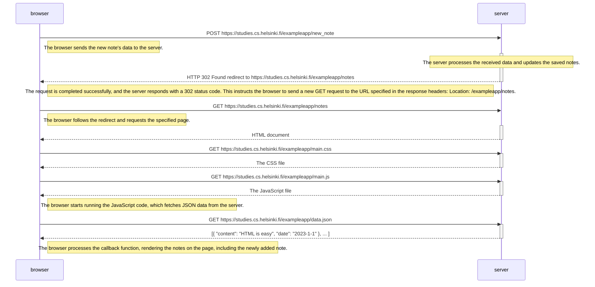

```mermaid
sequenceDiagram
    participant browser
    participant server

    browser->>server: POST https://studies.cs.helsinki.fi/exampleapp/new_note
    Note right of browser: The browser sends the new note's data to the server.
    activate server
    Note over server: The server processes the received data and updates the saved notes.
    server-->>browser: HTTP 302 Found redirect to https://studies.cs.helsinki.fi/exampleapp/notes
    deactivate server

    Note right of browser: The request is completed successfully, and the server responds with a 302 status code. This instructs the browser to send a new GET request to the URL specified in the response headers: Location: /exampleapp/notes.

    browser->>server: GET https://studies.cs.helsinki.fi/exampleapp/notes
    Note right of browser: The browser follows the redirect and requests the specified page.
    activate server
    server-->>browser: HTML document
    deactivate server

    browser->>server: GET https://studies.cs.helsinki.fi/exampleapp/main.css
    activate server
    server-->>browser: The CSS file
    deactivate server

    browser->>server: GET https://studies.cs.helsinki.fi/exampleapp/main.js
    activate server
    server-->>browser: The JavaScript file
    deactivate server

    Note right of browser: The browser starts running the JavaScript code, which fetches JSON data from the server.

    browser->>server: GET https://studies.cs.helsinki.fi/exampleapp/data.json
    activate server
    server-->>browser: [{ "content": "HTML is easy", "date": "2023-1-1" }, ... ]
    deactivate server

    Note right of browser: The browser processes the callback function, rendering the notes on the page, including the newly added note.
```