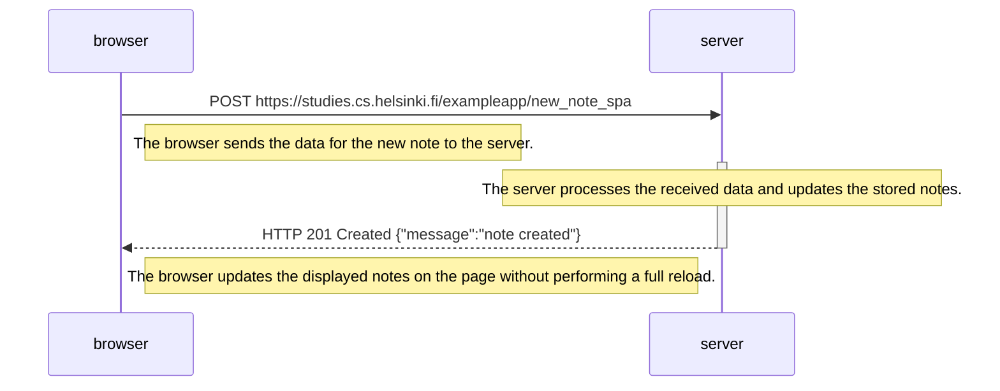

```mermaid
sequenceDiagram
    participant browser
    participant server 

    browser->>server: POST https://studies.cs.helsinki.fi/exampleapp/new_note_spa
    Note right of browser: The browser sends the data for the new note to the server.
    activate server
    Note over server: The server processes the received data and updates the stored notes.
    server-->>browser: HTTP 201 Created {"message":"note created"}
    deactivate server

    Note right of browser: The browser updates the displayed notes on the page without performing a full reload.
```